# cellpaintr Vignette

## Introduction

High-content imaging can capture detailed morphological and functional
features on a single-cell level. It has been widely used in drug screen
assays and for generating large-scale image datasets for machine
learning models. Software such as CellProfiler extract features from
high-content images for downstream analysis. CellProfiler implements a
suite of traditional image processing algorithms to segment cells and
extract about 1,000 morphological and texture features.

To simplify data analysis of CellProfiler features in R—many options
exist in Python, such as PyCytominer—we developed an R/Bioconductor
package. Our package leverages Bioconductor objects for batch correction
and dimension reduction, lowering the learning curve for users familiar
with single-cell RNA sequencing workflows.

## Installation

Install this package.

``` r

if (!require("BiocManager", quietly = TRUE)) {
    install.packages("BiocManager")
}
BiocManager::install("cellpaintr")
```

## Workflow

### Preparation

Load packages.

``` r

library(cellpaintr)
library(scater)
library(scrapper)
library(purrr)
library(dplyr)
library(ggrepel)
```

### Load Data

Load `CellProfiler` output and create a `SingleCellExperiment` object.

``` r

set.seed(23)
cell_file <- generate_data()
sce <- loadData(cell_file)
```

### Data Cleaning and Transformation

Prepare the data for machine learning.

``` r

# remove cells with missing features
sce <- removeNAs(sce)

# number of cells
plotCellsPerImage(sce)
```

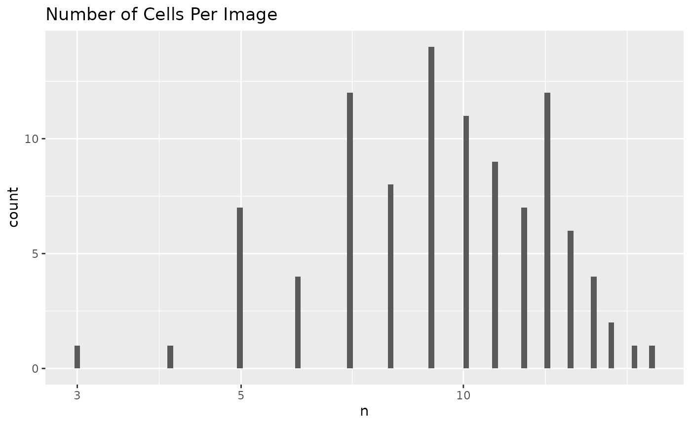

``` r

# remove outlier images
sce <- removeOutliers(sce, min = 0, max = 300)

# remove outlier cells
stats <- perCellQCMetrics(sce, assay.type = "features")
sce <- sce[, !isOutlier(stats$sum)]

# remove features with zero spread
sce <- removeLowVariance(sce, robust = TRUE)

# remove zero-inflated features
sce <- removeZeroInflation(sce)
```

Transform non-negatives features and scale all features.

``` r

sce <- transformLogScale(sce, robust = TRUE)
```

### Unsupervised Analysis

Pseudo-bulk over images.

``` r

aggr <- scrapper::aggregateAcrossCells(
    assay(sce, "tfmfeatures"),
    factors = colData(sce)[, c("ImageNumber", "Drug", "Patient")]
)
sce_aggr <- SingleCellExperiment(
    assays = list(sums = aggr$sums),
    colData = DataFrame(aggr$combinations, ncells = aggr$counts)
)
```

Use `scater` for exploratory data analysis. PCA on pseudo-bulk features.

``` r

sce_aggr <- scater::runPCA(sce_aggr,
    assay.type = "sums",
    ncomponents = 10
)
scater::plotReducedDim(sce_aggr, dimred = "PCA", colour_by = "Patient")
```

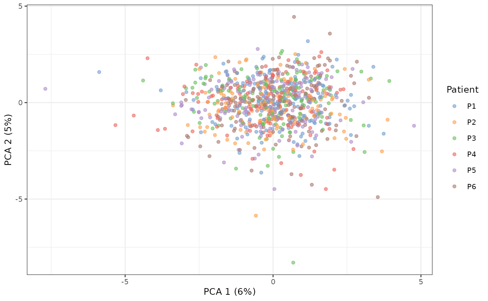

``` r

scater::plotReducedDim(sce_aggr, dimred = "PCA", colour_by = "Drug")
```

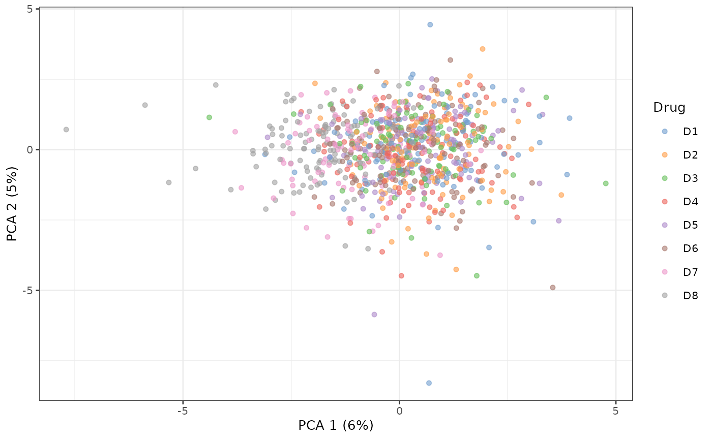

What is driving PC1?

``` r

plotPCACor(sce_aggr, filter_by = 1, assay_type = "sums")
```

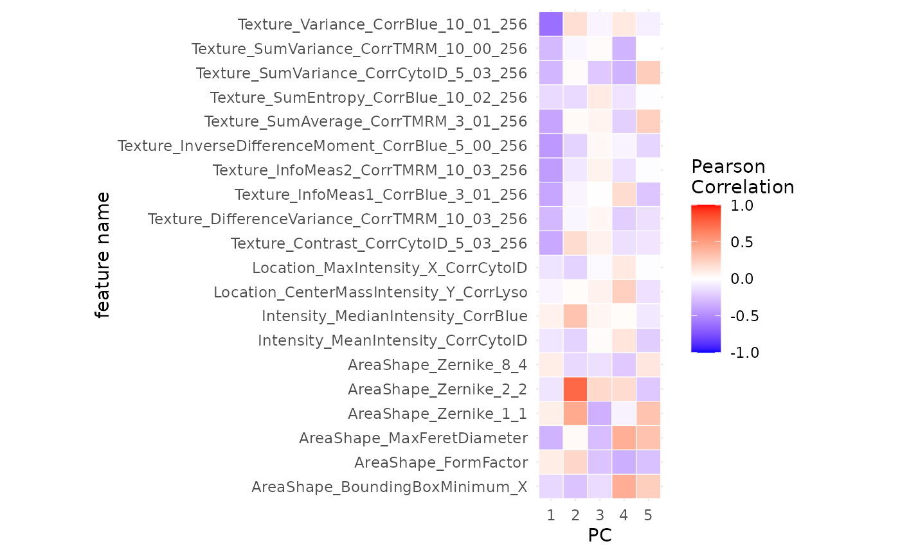

UMAP.

``` r

sce_aggr <- scater::runUMAP(sce_aggr, exprs_values = "sums")
scater::plotUMAP(sce_aggr, colour_by = "Patient")
```

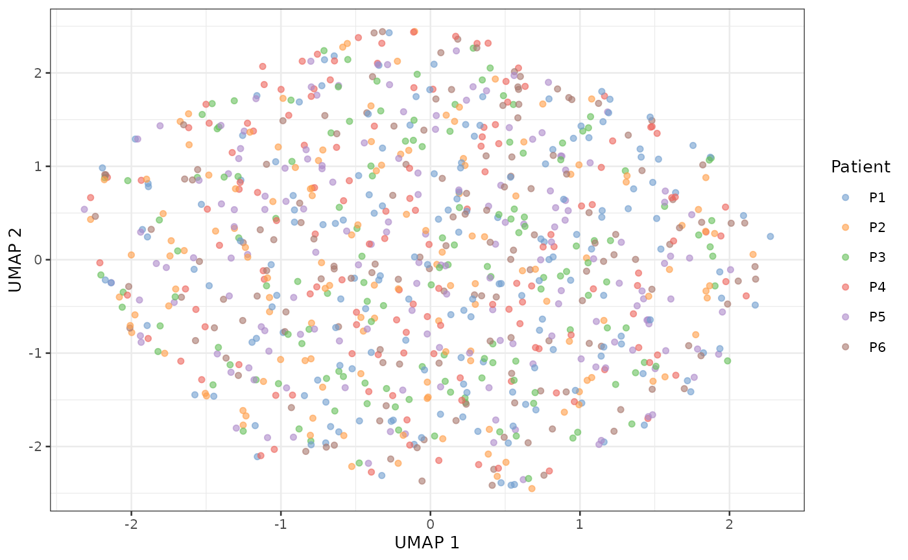

``` r

scater::plotUMAP(sce_aggr, colour_by = "Drug")
```

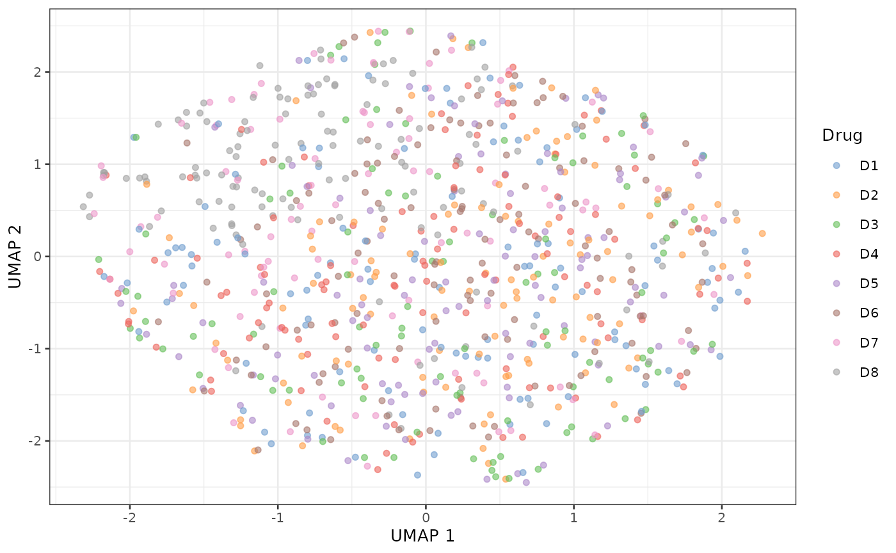

### Supervised Analysis

Compare positive control to negative control.

``` r

set.seed(23)

sce$Drug <- as.factor(sce$Drug)
sce$Drug <- relevel(sce$Drug, ref = "D1")

types <- c("AreaShape", "Intensity", "Texture")

sce_single <- predictLOO(
    sce,
    target = "Drug", group = "Patient",
    interest_level = "D7", reference_level = "D1",
    types = types,
    n_threads = 1
)
```

Summarize feature subgroups in a volcano plot.

``` r

volcanoPlot(sce_single,
    target = "Drug", group = "Patient",
    p_cutoff = 0.05, fc_cutoff = 0.5
)
```

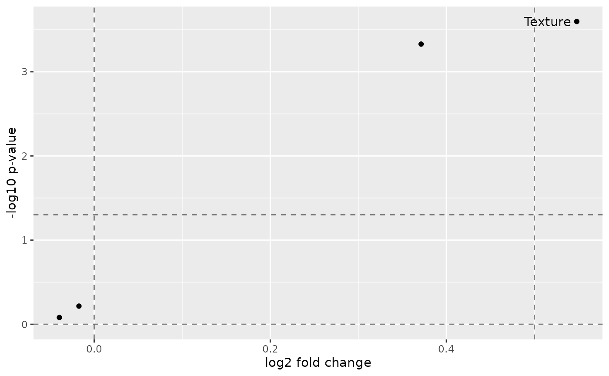

Individual scores.

``` r

plotLOO(sce_single, target = "Drug", group = "Patient")
```

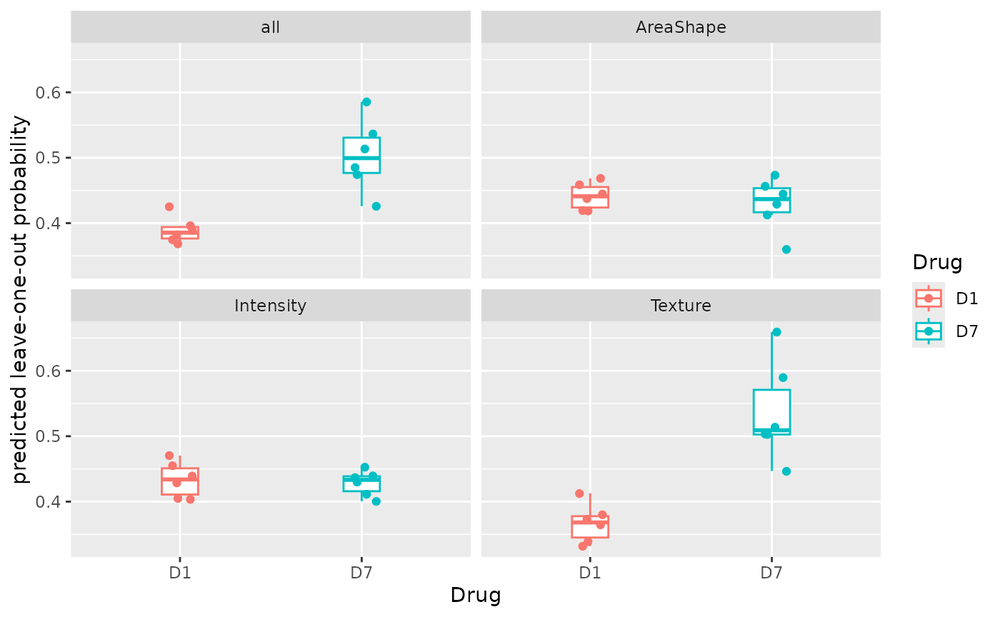

``` r

plotAUC(sce_single, target = "Drug", group = "Patient")
```

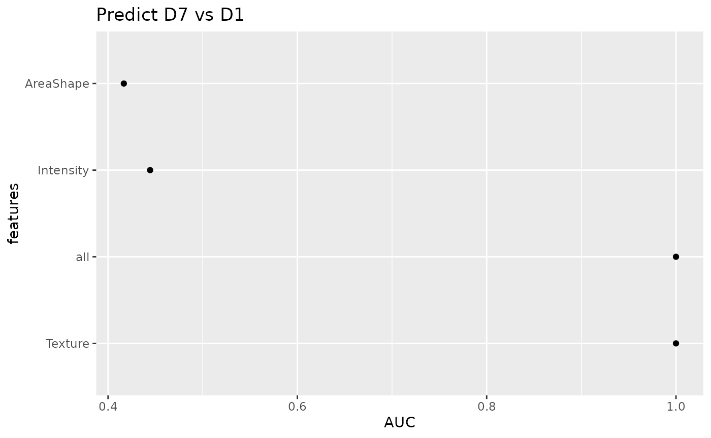

``` r

plotROC(sce_single, target = "Drug", group = "Patient")
```

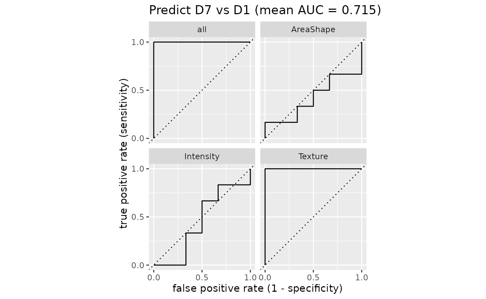

Compare a list of drugs to negative control.

``` r

set.seed(23)

reference_level <- "D1"
interest_levels <- setdiff(levels(sce$Drug), reference_level)

sce_list <- map(interest_levels, function(interest_level) {
    predictLOO(
        sce,
        target = "Drug", group = "Patient",
        interest_level = interest_level, reference_level = reference_level,
        types = types,
        n_threads = 1
    )
}, .progress = "drug screening")
```

Custom volcano plot for summarizing drugs faceted by features.

``` r

# prepare stats table
p_adj_cutoff <- 0.05
fc_cutoff <- 0.5
tb_stats <- lapply(sce_list, calculateStats,
    target = "Drug", group = "Patient"
) |>
    bind_rows() |>
    mutate(pvalue_adj = p.adjust(pvalue, method = "BH")) |>
    mutate(Selection = ifelse(
        pvalue_adj < p_adj_cutoff & log2FoldChange > fc_cutoff,
        Target, ""
    ))

# volcano plot
tb_stats |>
    ggplot(aes(log2FoldChange, -log10(pvalue_adj), label = Selection)) +
    geom_vline(xintercept = c(0, fc_cutoff), alpha = 0.5, linetype = "dashed") +
    geom_hline(
        yintercept = c(0, -log10(p_adj_cutoff)), alpha = 0.5,
        linetype = "dashed"
    ) +
    geom_point(aes(color = Target)) +
    geom_text_repel(aes(color = Target), max.overlaps = Inf) +
    xlab("log2 fold change") +
    ylab("-log10 p-value (BH adjusted)") +
    facet_wrap(~Feature) +
    ggtitle(paste0("False Discovery Rate: ", 100 * p_adj_cutoff, "%"))
```

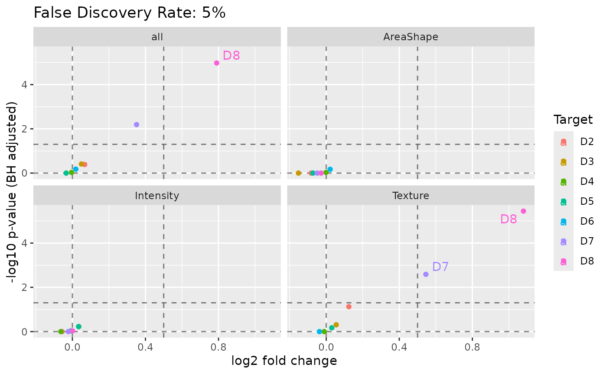

## Session Info

``` r

sessionInfo()
```

    ## R version 4.5.3 (2026-03-11)
    ## Platform: x86_64-pc-linux-gnu
    ## Running under: Ubuntu 24.04.4 LTS
    ## 
    ## Matrix products: default
    ## BLAS:   /usr/lib/x86_64-linux-gnu/openblas-pthread/libblas.so.3 
    ## LAPACK: /usr/lib/x86_64-linux-gnu/openblas-pthread/libopenblasp-r0.3.26.so;  LAPACK version 3.12.0
    ## 
    ## locale:
    ##  [1] LC_CTYPE=C.UTF-8       LC_NUMERIC=C           LC_TIME=C.UTF-8       
    ##  [4] LC_COLLATE=C.UTF-8     LC_MONETARY=C.UTF-8    LC_MESSAGES=C.UTF-8   
    ##  [7] LC_PAPER=C.UTF-8       LC_NAME=C              LC_ADDRESS=C          
    ## [10] LC_TELEPHONE=C         LC_MEASUREMENT=C.UTF-8 LC_IDENTIFICATION=C   
    ## 
    ## time zone: UTC
    ## tzcode source: system (glibc)
    ## 
    ## attached base packages:
    ## [1] stats4    stats     graphics  grDevices datasets  utils     methods  
    ## [8] base     
    ## 
    ## other attached packages:
    ##  [1] ggrepel_0.9.8               dplyr_1.2.1                
    ##  [3] purrr_1.2.2                 scrapper_1.4.0             
    ##  [5] scater_1.38.1               ggplot2_4.0.3              
    ##  [7] scuttle_1.20.0              cellpaintr_0.3.0           
    ##  [9] SingleCellExperiment_1.32.0 SummarizedExperiment_1.40.0
    ## [11] Biobase_2.70.0              GenomicRanges_1.62.1       
    ## [13] Seqinfo_1.0.0               IRanges_2.44.0             
    ## [15] S4Vectors_0.48.1            BiocGenerics_0.56.0        
    ## [17] generics_0.1.4              MatrixGenerics_1.22.0      
    ## [19] matrixStats_1.5.0           BiocStyle_2.38.0           
    ## 
    ## loaded via a namespace (and not attached):
    ##  [1] gridExtra_2.3.1     rlang_1.3.0         magrittr_2.0.5     
    ##  [4] furrr_0.4.0         otel_0.2.0          compiler_4.5.3     
    ##  [7] systemfonts_1.3.2   vctrs_0.7.3         stringr_1.6.0      
    ## [10] crayon_1.5.3        pkgconfig_2.0.3     fastmap_1.2.0      
    ## [13] XVector_0.50.0      labeling_0.4.3      rmarkdown_2.31     
    ## [16] tzdb_0.5.0          ggbeeswarm_0.7.3    ragg_1.5.2         
    ## [19] bit_4.6.0           xfun_0.60           cachem_1.1.0       
    ## [22] beachmat_2.26.0     jsonlite_2.0.0      DelayedArray_0.36.1
    ## [25] BiocParallel_1.44.0 irlba_2.3.7         parallel_4.5.3     
    ## [28] R6_2.6.1            bslib_0.11.0        stringi_1.8.7      
    ## [31] rsample_1.3.2       RColorBrewer_1.1-3  ranger_0.18.0      
    ## [34] parallelly_1.48.0   jquerylib_0.1.4     Rcpp_1.1.2         
    ## [37] bookdown_0.47       knitr_1.51          FNN_1.1.4.1        
    ## [40] readr_2.2.0         Matrix_1.7-4        tidyselect_1.2.1   
    ## [43] abind_1.4-8         yaml_2.3.12         viridis_0.6.5      
    ## [46] codetools_0.2-20    listenv_1.0.0       lattice_0.22-9     
    ## [49] tibble_3.3.1        withr_3.0.3         S7_0.2.2           
    ## [52] evaluate_1.0.5      future_1.70.0       desc_1.4.3         
    ## [55] pillar_1.11.1       BiocManager_1.30.27 renv_1.1.5         
    ## [58] vroom_1.7.1         hms_1.1.4           scales_1.4.0       
    ## [61] globals_0.19.1      glue_1.8.1          tools_4.5.3        
    ## [64] BiocNeighbors_2.4.0 RSpectra_0.16-2     ScaledMatrix_1.18.0
    ## [67] fs_2.1.0            grid_4.5.3          yardstick_1.4.0    
    ## [70] tidyr_1.3.2         beeswarm_0.4.0      BiocSingular_1.26.1
    ## [73] vipor_0.4.7         cli_3.6.6           rsvd_1.0.5         
    ## [76] textshaping_1.0.5   parsnip_1.6.0       S4Arrays_1.10.1    
    ## [79] viridisLite_0.4.3   uwot_0.2.4          gtable_0.3.6       
    ## [82] sass_0.4.10         digest_0.6.39       SparseArray_1.10.10
    ## [85] farver_2.1.2        htmltools_0.5.9     pkgdown_2.2.1      
    ## [88] lifecycle_1.0.5     hardhat_1.4.3       sparsevctrs_0.3.6  
    ## [91] bit64_4.8.2
